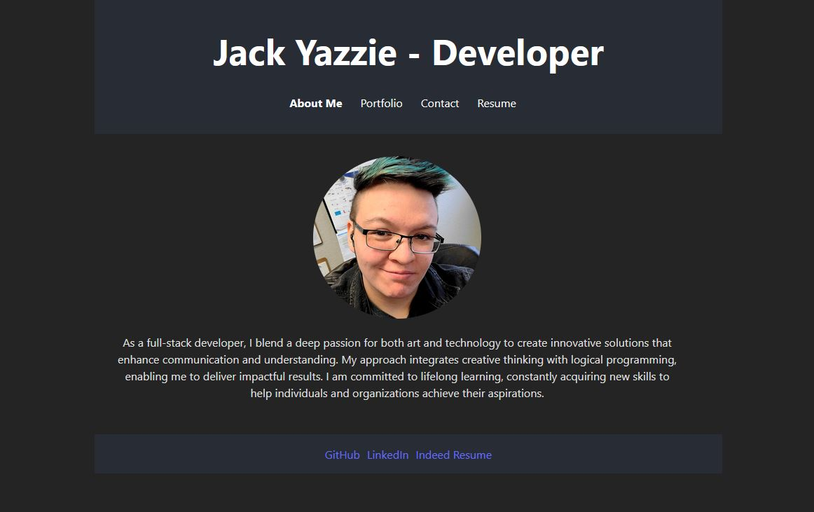

# Jack Yazzie - Portfolio and Resume

## Description
Using react in javascript I created and deployed a full stack website to show off my skills to potential employers.

## Deployed site link and example

https://main--gilded-youtiao-aa50a3.netlify.app/



## Table of Contents
- [Description](#description)
- [Installation](#installation)
- [Usage](#usage)
- [Contributing](#contributing)
- [License](#license)
- [Questions](#questions)

## Installation
```
There is no need to install locally, however, one would run npm i and npm run dev to test it.
```

## Usage
It is my portfolio and contains a downloadable resume, contact information, examples of my work, and is an example in and of itself.

## Contributing
Download locally using npm i and npm run dev and send me any github message with suggestions on improvements.

## License
This project is licensed under the MIT license.

## Questions
If you have any questions please go to my github:
https://github.com/SleekWingX 
or email at:
jackyazzie365@gmail.com